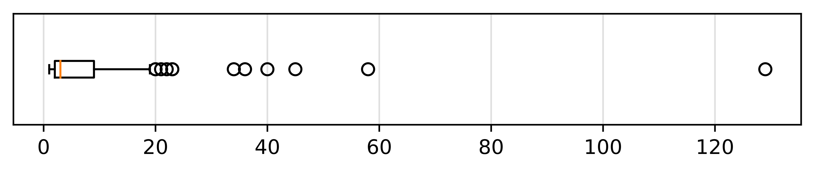

# Lagoa Dataset

For our experiments, we developed a new dataset named **Lagoa**.  
It includes data collected from cyclists who completed laps around the Pampulha Lagoon in Belo Horizonte, Minas Gerais, Brazil.  

The dataset is structured as a dictionary:  
- **Key** → the cyclist’s unique ID.  
- **Value** → a matrix with route information. Each row corresponds to one observation.  

The recorded variables include:  
- Time  
- Heart rate  
- Smoothed velocity  
- Grade smooth  
- Power output (watts)  
- Distance  
- Other signals (excluded from our analysis due to being available only for a small subset of riders).  

The data collection took place between **January and July 2024**. In total, the dataset covers **126 cyclists**, accounting for **1014 rides**. Most participants completed multiple laps around the lagoon, which makes the dataset particularly rich for analyzing repeated patterns.  

<p align="center">
  
</p>

<p align="center">
  <em>Lagoa dataset cyclist tours. The $x$-axis corresponds to number of tours (mean=8.04, std=14.4). 
  The last outlier corresponds to a cyclist that repeats the tour 126 times.</em>
</p>


---
## Access

You can access the dataset at the following link:  

```text
[Insert Google Drive link here]
```

---

## 📖 Citation

If you use this dataset, please cite our paper:

Title: **Unsupervised Analysis of Cyclist Performance for Route Segmentation and Ranking**  
Authors: Rensso Mora-Colque and William Robson Schwartz  
*To appear in Proceedings of the 22nd International Conference on Informatics in Control, Automation and Robotics (ICINCO 2025), Marbella, Spain.*

```bibtex
@inproceedings{mora2025unsupervised,
  author    = {Rensso Mora-Colque and William Robson Schwartz},
  title     = {Unsupervised Analysis of Cyclist Performance for Route Segmentation and Ranking},
  booktitle = {Proceedings of the 22nd International Conference on Informatics in Control, Automation and Robotics (ICINCO)},
  year      = {2025},
  address   = {Marbella, Spain},
  note      = {To appear}
}
```


---


